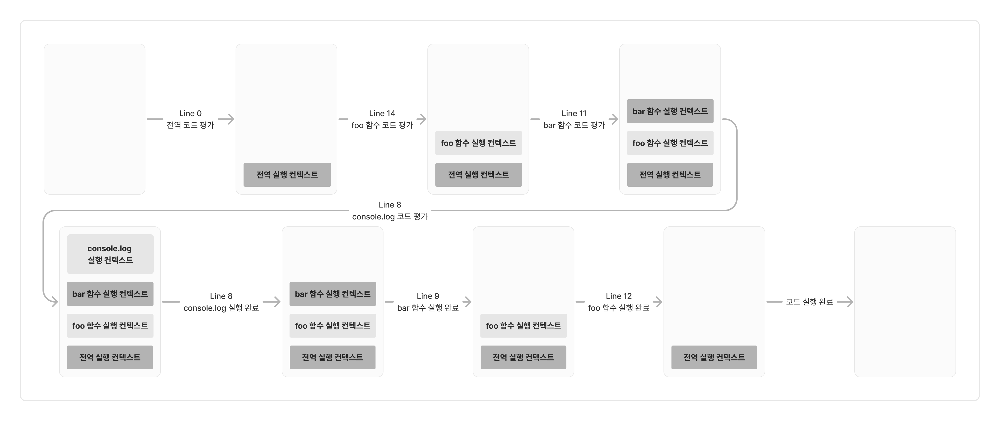

# 실행 컨텍스트
실행 컨텍스트는 자바스크립트의 동작 원리를 담고 있는 핵심 개념으로, 자바스크립트가 스코프를 기반으로 식별자와 식별자 바인딩을 관리하는 방식, 호이스팅이 발생하는 이유, 클로저의 동작 방식, 태스크 큐와 이벤트 핸들러, 비동기 처리의 동작 방식 등을 이해할 수 있다. 

## 소스코드의 타입
- 전역 코드: 전역에 존재하는 소스코드. 전역에 정의된 함수, 클래스 등의 내부 코드는 포함하지 않는다.
- 함수코드: 함수 내부에 존재하는 소스코드. 함수 내부에 중첩된 함수, 클래스 등의 내부 코드는 포함하지 않는다.
- eval 코드: 빌트인 전역 함수인 `eval`함수에 인수로 전달되어 실행되는 소스코드.
- 모듈 코드: 모듈 내부에 존재하는 소스코드. 모듈 내부의 함수, 클래스 등의 내부 코드는 포함하지 않는다.

자바스크립트는 소스코드의 타입에 따라실행 컨텍스트를 생성하는 과정과 관리 내용이 다르다. 

### 전역 코드
- 전역 코드는 전역 변수를 관리하기 위해 최상위 스코프인 전역 스코프를 생성해야 함.
- `var` 키워드로 선언된 전역 변수와 함수 선언문으로 정의된 전역 함수를 전역 객체의 프로퍼티와 메서드로 바인딩하고 참조하기 위해 전역 객체와 연결되어야 함.
- 전역 코드가 평가되면 전역 실행 컨텍스트가 생성됨.
### 함수 코드
- 함수 코드는 지역 스코프를 생성하고 지역 변수, 매개변수, `arguments` 객체를 관리해야 함.
- 생성한 지역 스코프를 전역 스코프에서 시작하는 스코프 체인의 일원으로 연결해야 함.
- 함수 코드가 평가되면 함수 실행 컨텍스트가 생성됨
### `eval` 코드
- `eval` 코드는 strict mode에서 자신만의 독자적인 스코프를 생성함.
- `eval` 코드가 평가되면 `eval` 실행 컨텍스트가 생성된다.
### 모듈 코드
- 모듈 코드는 모듈별로 독립적인 모듈 스코프를 생성한다. 모듈 코드가 평가되면 모듈 실행 컨텍스트가 생성된다.

## 소스코드의 평가와 실행
자바스크립트 코드는 소스 코드를 2개의 과정으로 나누어 처리한다.
1. 소스코드의 평가
	- 실행 컨텍스트를 생성하고 변수, 함수 등의 선언문만 먼저 실행하여 생성된 변수나 함수 식별자를 키로 실행 컨텍스트가 관리하는 스코프(렉시컬 환경의 환경 레코드)에 등록
2. 소스코드의 실행
	- 선언문을 제외한 소스코드가 순차적으로 실행된다.(런타임 시작)
	- 소스코드 실행에 필요한 정보(변수나 함수의 참조)를 실행 컨텍스트가 관리하는 스코프에서 검색하여 취득한다. 변수 값의 변경 등 소스 코드의 실행 결과는 다시 실행 컨텍스트가 관리하는 스코프에 등록된다.

## 실행 컨텍스트의 역할
### 1. 전역 코드 평가
- 전역 코드의 변수 선언문과 함수 선언문 실행
- 생성된 전역 변수와 전역 함수가 실행 컨텍스트가 관리하는 전역 스코프에 등록
- `var` 키워드로 선언된 전역 변수와 함수 선언문으로 정의된 전역 함수는 전역 객체의 프로퍼티로 등록 
### 2. 전역 코드 실행
- 런타임 시작 (전역 코드 순차적으로 실행)
- 전역 변수에 값 할당 및 함수 호출
- 함수 호출시 전역 코드 실행을 일시 중단하고 코드 실행 순서를 변경하여 함수 내부로 진입
### 3. 함수 코드 평가
- 함수 호출에 의해 함수 내부로 진입하면 함수 내부 코드 실행 이전에 함수 코드 평가 과정 수행
- 매개변수와 지역 변수 선언문 실행
- 생성된 매개변수와 지역 변수가 실행 컨텍스트가 관리하는 지역 스코프에 등록되고 `this` 바인딩 결정
### 4. 함수 코드 실행
- 런타임 시작 (함수 코드 순차적으로 실행)
- 매개변수와 지역 변수에 값 할당 및 메서드 호출

위처럼 코드가 실행되려면 스코프를 구분하여 식별자와 바인딩된 값이 관리되어야 한다. 또한, 중첩 관계에 의해 스코프 체인을 형성하여 식별자를 검색할 수 있어야 하고, 전역 객체의 프로퍼티도 전역 변수처럼 검색할 수 있어야 한다. 

- 실행 컨텍스트란, **소스코드를 실행하는 데 필요한 환경을 제공하고 코드의 실행 결과를 실제로 관리하는 영역**을 말한다. 
- 식별자(변수, 함수, 클래스 등의 이름)를 등록하고 관리하는 스코프와 코드 실행 순서 관리를 구현한 내부 매커니즘
- 모든 코드는 실행 컨텍스트를 통해 실행되고 관리됨.
- 식별자와 스코프는 실행 컨텍스트의 **렉시컬 환경**으로 관리하고, 코드 실행 순서는 **실행 컨텍스트 스택**으로 관리

## 실행 컨텍스트 스택
소스코드 실행시, 전역 코드 평가 → 전역 코드 실행 컨텍스트 생성 → 전역 코드 실행 → 함수 호출 → 함수 코드 평가 → 함수 실행 컨텍스트 생성 → 함수 코드 실행의 과정을 거친다. 생성된 실행 컨텍스트는 스택으로 관리되고, 이 스택을 실행 컨텍스트 스택이라고 부른다. 시간의 흐름에 따라 실행 컨텍스트 스택에는 실행 컨텍스트가 추가 및 제거된다.

```javascript
const x = 1;

function foo() {
  const y = 2;
  function bar() {
    const z = 3;
    console.log(x, y, z);
  }
  bar();
}

foo();
```


다음 코드를 실행할 때의 실행 컨텍스트 스택는 다음과 같다. 



이처럼 실행 컨텍스트 스택은 코드의 실행 순서를 관리한다. 소스코드가 평가되면 실행 컨텍스트가 생성되고, 실행 컨텍스트 스택의 최상위에 쌓인다. **실행 컨텍스트 스택의 최상위 값은 현재 실행 중인 코드의 실행 컨텍스트**이며, 이를 실행 중인 실행 컨텍스트라 한다. 

## 렉시컬 환경
렉시컬 환경은 **식별자와 식별자에 바인딩된 값, 그리고 상위 스코프에 대한 참조를 기록하는 자료구조**로 실행 컨텍스트를 구성하는 컴포넌트이다. 
- 키와 값을 갖는 객체 형태의 스코프를 생성하여 식별자를 키로 등록하고, 식별자에 바인딩된 값을 관리한다.
- 스코프를 구분하여 식별자를 등록하고 관리하는 저장소 역할을 하는 렉시컬 스코프의 실체이다.
- 실행 컨텍스트는 `LexicalEnvironment`와 `VariableEnvironment` 컴포넌트로 구성되며, 초기에는 동일한 렉시컬 환경을 참조하지만 몇 가지 상황에서 두 컴포넌트의 내용이 달라지는 경우도 있다. 
- 두 컴포넌트를 구분하지 않고 하나의 렉시컬 환경으로 생각할 경우, 렉시컬 환경은 환경 레코드, 외부 렉시컬 환경에 대한 참조 2가지 컴포넌트로 구성된다.
- 환경 레코드(`Environment Record`): 스코프에 포함된 식별자를 등록하고 등록된 식별자에 바인딩된 값을 관리하는 저장소로, 소스코드의 타입에 따라 관리하는 내용에 차이가 있다.
- 외부 렉시컬 환경에 대한 참조(`Outer Lexical Envirionment Reference`): 상위 스코프를 가리키며, 이는 상위 코드의 렉시컬 환경을 말한다. 외부 렉시컬 환경에 대한 참조를 통해 단방향 연결 리스트 스코프 체인을 구현한다.

## 실행 컨텍스트의 생성과 식별자 검색 과정
### 1. 전역 객체 생성
- 전역 객체는 전역 코드 평가 이전에 생성된다. 빌트인 전역 프로퍼티, 빌트인 전역 함수, 표준 빌트인 객체, 동작 환경(클라이언트 사이드 혹은 서버 사이드)에 따라 Web API나 특정 환경을 위한 호스트 객체를 포함한다. 
- 전역 객체 또한 `Object.prototype`을 상속받는 프로토타입 체인의 일원이다. 

### 2. 전역 코드 평가
- 소스코드가 로드되면, 자바스크립트 엔진은 전역 코드를 평가한다. 
- 전역 코드 평가 진행 과정
	1. 전역 실행 컨텍스트 생성
	2. 전역 렉시컬 환경 생성
		1. 전역 환경 레코드 생성
			1. 객체 환경 레코드 생성
			2. 선언적 환경 레코드 생성
		2. this 바인딩
		3. 외부 렉시컬 환경에 대한 참조 결정
#### 1. 전역 실행 컨텍스트 생성
- 비어 있는 전역 실행 컨텍스트를 생성하여 실행 컨텍스트 스택에 푸시
- 전역 실행 컨텍스트가 실행 중인 실행 컨텍스트가 된다.
#### 2. 전역 렉시컬 환경 생성
- 전역 렉시컬 환경을 생성하고 전역 실행 컨텍스트에 바인딩
- 렉시컬 환경은 **환경 레코드**와 **외부 렉시컬 환경에 대한 참조**로 구성
#### 2.1. 전역 환경 레코드 생성
- 전역 환경 레코드는 전역 변수를 관리하는 전역 스코프, 전역 객체의 빌트인 전역 프로퍼티와 빌트인 전역 함수, 표준 빌트인 객체를 제공함
- ES6 이전에는 모든 전역 변수가 전역 객체의 프로퍼티가 되었기 때문에 전역 객체가 전역 환경 레코드의 역할을 했지만, ES6의 `let`, `const` 키워드로 선언한 전역 변수는 전역 객체의 프로퍼티가 되지 않고 개념적인 블록 내에 존재한다. 따라서 `var`키워드와 `let`, `const` 키워드로 선언한 전역변수를 구분하여 관리하기 위해 전역 환경 레코드는 **객체 환경 레코드**와 **선언적 환경 레코드**로 구성한다.
- 객체 환경 레코드: 기존 전역 객체가 관리하던 `var`키워드로 선언한 전역 변수, 함수 선언문으로 정의한 전역 함수, 빌트인 전역 프로퍼티와 빌트인 전역 함수, 표준 빌트인 객체 관리
- 선언적 환경 레코드: `let`, `const` 키워드로 선언한 전역 변수 관리
- 두 환경 레코드가 협력하여 전역 스코프와 전역 객체를 관리
#### 2.1.1. 객체 환경 레코드 생성
- 객체 환경 레코드는 전역 객체 생성시 생성된 `BindingObject`라 부르는 객체와 연결됨.
- 전역 코드 평가 과정에서 `var` 키워드로 선언한 전역 변수, 함수 선언문으로 정의한 전역 함수는 `BindingObject`를 통해 전역 객체의 프로퍼티와 메서드가 됨.
- 이 때 등록된 식별자를 전역 환경 레코드의 객체 환경 레코드에서 검색하면 전역 객체의 프로퍼티를 검색하여 반환.
- 전역 객체에 변수 식별자를 키로 등록하며 암묵적으로 `undefined`를 바인딩(선언과 동시에 초기화)하여, 코드 실행 단계에서 변수 선언문 이전에서도 사용할 수 있고, `var` 키워드에 할당한 함수 표현식도 이와 동일하게 동작한다. **이로 인해 변수 호이스팅이 발생한다.**
#### 2.1.2. 선언적 환경 레코드 생성
- `let`, `const` 키워드로 선언한 전역 변수는 선언적 환경 레코드에 등록되고 관리됨. 이 전역 변수들에 대해 선언적 환경 레코드가 개념적인 블록 역할을 함.
- 선언 단계와 초기화 단계가 분리되어 진행하며, 런타임에 실행 흐름이 변수 선언문에 도달하기 전까지 일시적 사각지대에 빠지게 된다.
- **`let`, `const` 키워드로 선언한 변수 또한 변수 호이스팅이 발생한다.** 단, 런타임에 컨트롤이 변수 선언문에 도달하기 전까지 일시적 사각지대에 빠져 참조할 수 없어 참조 에러가 발생한다.
#### 2.2. `this` 바인딩
- 일반적으로 전역 코드의 `this`는 전역 객체를 가리키므로 전역 환경 레코드의 `[[GlobalThisValue]]` 내부 슬롯에는 전역 객체가 바인딩 된다. 전역 객체에서 `this` 참조시 전역 환경 레코드의 `[[GlobalThisValue]]` 내부 슬롯에 바인딩되어 있는 객체가 반환된다.
- 전역 환경 레코드를 구성하는 객체 환경 레코드 및 선언적 환경 레코드에는 `this` 바인딩이 존재 하지 않고, 전역 환경 레코드와 함수 환경 레코드에만 존재한다. 
#### 2.3. 외부 렉시컬 환경에 대한 참조 결정
- 현재 평가 중인 소스코드는 전역 코드이므로, 전역 렉시컬 환경의 외부 렉시컬 환경에 대한 참조는 `null`이 참조된다. 이는 전역 렉시컬 환경이 스코프 체인의 종점에 존재함을 의미한다.
### 3. 전역 코드 실행
- 변수 할당문, 함수 호출문을 실행하기 위해서는 해당 식별자가 선언되었는지 확인해야 한다.
- 스코프가 다르면 동일한 이름의 식별자를 가질 수 있다. 따라서 어느 스코프의 식별자를 참조하면 되는지 결정할 필요가 있고, 이를 **식별자 결정(identifier resolution)** 이라 한다. 실행 중인 실행 컨텍스트에서 식별자를 검색하기 시작한다. 만약 실행 중인 실행 컨텍스트의 렉시컬 환경에서 식별자를 검색할 수 없으면, 외부 렉시컬 환경에 대한 참조가 가리키는 렉시컬 환경(상위 스코프)으로 이동하여 식별자를 검색한다.
- 전역 렉시컬 환경에서 검색할 수 없는 식별자는 Reference Error가 발생한다. 

### 4. 함수 호출 시 함수 코드 평가
- 함수가 호출되면 전역 코드의 실행을 일시 중단하고 함수 내부로 코드의 제어권이 이동하고, 함수를 평가하기 시작한다.
- 함수 코드 평가 진행 과정
	1. 함수 실행 컨텍스트 생성
	2. 함수 렉시컬 환경 생성
		1. 함수 환경 레코드 생성
		2. this 바인딩
		3. 외부 렉시컬 환경에 대한 참조 결정
- 전체적으로 전역 코드 평가 과정과 비슷하며, 일부분만 다르다. 
#### 1. 함수 실행 컨텍스트 생성
- 함수 실행 컨텍스트를 생성하고 함수 렉시컬 환경이 완성되면 실행 컨텍스트 스택에 푸시
- 함수 실행 컨텍스트가 실행 중인 실행 컨텍스트가 된다.
#### 2. 함수 렉시컬 환경 생성
- 함수 렉시컬 환경을 생성하고 함수 실행 컨텍스트에 바인딩
- 렉시컬 환경은 **환경 레코드**와 **외부 렉시컬 환경에 대한 참조**로 구성
#### 2.1. 함수 환경 레코드 생성
- 함수 환경 레코드는 매개변수, `arguments` 객체, 함수 내부에서 선언한 지역 변수와 중첩 함수를 등록하고 관리
#### 2.2. `this` 바인딩
- 함수 환경 레코드의 `[[ThisValue]]` 내부 슬롯에 `this`가 바인딩되며, 슬롯에 바인딩될 객체는 함수 호출 방식에 따라 결정
- 함수 내부에서 `this`를 참조하면 내부 슬롯에 바인딩 되어 있는 객체 반환
#### 2.3. 외부 렉시컬 환경에 대한 참조 결정
- 렉시컬 스코프는 함수를 어디서 호출했는지가 아니라 어디에 정의했는지에 따라 상위 스코프를 결정한다.
	- 자바스크립트 엔진은 함수 정의를 평가하여 함수 객체를 생성할 때 현재 실행 중인 실행 컨텍스트의 렉시컬 환경(함수의 상위 스코프)을 함수 객체 내부 슬롯 `[[Environment]]`에 저장한다. 함수 렉시컬 환경의 외부 렉시컬 환경에 대한 참조에는 함수 객체 내부 슬롯 `[[Environment]]`에 저장된 렉시컬 환경의 참조가 할당된다. 즉, 내부 슬롯 `[[Environment]]`이 렉시컬 스코프를 구현하는 매커니즘이다.
### 5. 함수 코드 실행
- 함수 내 코드가 실행되면서 식별자 결정을 위해 실행 중인 실행 컨텍스트의 렉시컬 환경에서 식별자를 검색한다. 존재하지 않을 경우, 외부 렉시컬 환경에 대한 참조가 가리키는 렉시컬 환경으로 이동하여 식별자를 검색한다.
### 6. 중첩 함수 코드 평가
- 함수 내부의 중첩 함수 또한 마찬가지로 호출되면 중첩 함수 내부로 코드 제어권이 이동하고 코드를 평가한다.
- 중첩 함수는 함수 내부에서 선언되었으므로, 외부 렉시컬 환경에 대한 참조는 상위 함수의 렉시컬 스코프를 가리킨다.
### 7. 중첩 함수 코드 실행
- 중첩 함수 내부의 코드가 순차적으로 실행된다. 
### 8. 중첩 함수 코드 실행 종료
- 더이상 실행할 코드가 없으면 코드 실행이 종료된다. 실행 컨텍스트 스택에서 해당 실행 컨텍스트를 pop하여 제거한다.
- 실행 컨텍스트 스택에서 제거되었다고, 렉시컬 환경이 즉시 소멸하지는 않는다. 렉시컬 환경은 실행 컨텍스트에 의해 참조되기는 하지만 독립적인 객체로, 누군가에 의해 참조되지 않을 때 가비지 컬렉터에 의해 메모리 공간의 확보가 해제되어 소멸한다. 
### 9. 함수 코드 실행 종료
- 더이상 실행할 코드가 없으면 코드 실행이 종료된다. 실행 컨텍스트 스택에서 해당 실행 컨텍스트를 pop하여 제거한다.
### 10. 전역 코드 실행 종료
- 더이상 실행할 코드가 없으면 코드 실행이 종료된다. 실행 컨텍스트 스택에서 해당 실행 컨텍스트를 pop하여 제거한다.
## 실행 컨텍스트와 블록 레벨 스코프
- `var` 키워드는 함수의 코드 블록만 지역 스코프로 인정하는 함수 레벨 스코프를 따르며, `let`, `const` 키워드는 모든 코드 블록(함수, `if`, `for`, `while`, `try/catch`)을 지역 스코프로 인정하는 블록 레벨 스코프를 따른다.
- 코드 블록 내에서 `let`, `const` 키워드로 변수가 선언될 경우, 코드 블록을 위한 블록 레벨 스코프를 생성해야 한다. 이를 위해 선언적 환경 레코드를 갖는 렉시컬 환경을 새롭게 생성하여 기존의 전역 렉시컬 환경을 교체한다. 
- 새롭게 생성된 렉시컬 환경의 외부 렉시컬 환경에 대한 참조는 이전의 전역 렉시컬 환경을 가리킨다. 
