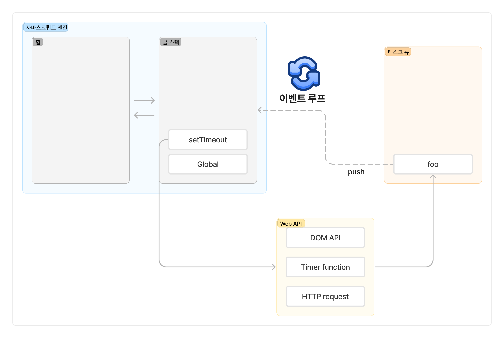

# 비동기 프로그래밍

## 동기 처리와 비동기 처리

### 동기 처리
[실행 컨텍스트](https://github.com/front-study-2024/deep-dive-js/blob/main/23.%20실행%20컨텍스트/1lsang.md)에서 살펴본 것과 같이 함수 호출시, 다음과 같은 단계로 코드가 실행된다. 
1. 함수 코드 평가
2. 함수 실행 컨텍스트 생성
3. 실행 컨텍스트 스택(콜 스택)에 함수 실행 컨텍스트 푸시
4. 함수 코드 실행
5. 함수 코드 실행 종료
6. 함수 실행 컨텍스트 팝

함수가 실행되기 위해서는 함수 실행 컨텍스트가 실행 컨텍스트 스택에 푸시되어야 한다. 

**자바스크립트 엔진은 단 하나의 실행 컨텍스트 스택을 가진다.** 이는 함수를 동시에 2개 이상 실행할 수 없는 것을 의미하며, 실행 컨텍스트 스택의 최상위 요소인 "실행 중인 실행 컨텍스트"를 제외한 모든 실행 컨텍스트는 모두 실행 대기 중인 태스크이다. 해당 태스크들은 현재 실행 중인 함수가 종료된 이후에(실행 중인 실행 컨텍스트가 제거되면) 실행되기 시작된다. 

자바스크립트 엔진은 한 번에 하나의 태스크만 실행할 수 있는 **싱글 스레드 방식**으로 동작한다. 따라서 **시간이 걸리는 태스크를 실행하는 경우 블로킹(작업 중단)이 발생한다.**  이처럼 현재 실행 중인 태스크가 종료할 때까지 다음에 실행될 태스크가 대기하는 방식을 **동기(synchronous) 처리**라고 한다. 

- 장점: 태스크를 순서대로 하나씩 처리하므로 실행 순서가 보장된다.
- 단점: 앞선 태스크가 종료할 때까지 이후 태스크들이 블로킹 된다.

### 비동기 처리
`setTimeout` 함수를 사용하면 일정 시간이 경과한 이후에 콜백 함수를 호출하지만, 이후 태스크를 블로킹하지 않고 곧바로 실행한다. 이처럼 현재 실행 중인 태스크가 종료되지 않은 상태라 해도 다음 태스크를 곧바로 실행하는 방식을 **비동기(asynchronous) 처리**라고 한다.

- 장점: 현재 실행 중인 태스크가 종료되지 않은 상태라도 태스크를 곧바로 실행하므로 블로킹이 발생하지 않는다.
- 단점: 태스크의 실행 순서가 보장되지 않는다. 

비동기 처리를 수행하는 비동기 함수는 전통적으로 콜백패턴을 사용한다. 이는 콜백 헬을 발생시켜 가독성을 나쁘게 하고, 비동기 처리중 발생한 에러의 예외 처리가 어려우며, 여러 개의 비동기 처리를 한 번에 처리하는 데도 한계가 있다. 

`setTimer`, `setInterval`, HTTP 요청, 이벤트 핸들러는 비동기 처리 방식으로 동작한다. 

## 이벤트 루프와 태스크 큐
자바스크립트는 싱글 스레드로 동작한다는 특징을 가진다. 하지만 브라우저가 동작하는 것을 보면 많은 태스크가 동시에 처리되는 것처럼 보인다. 브라우저는 자바스크립트의 동시성을 지원하기 위해 내장되어 있는 기능인 이벤트 루프를 사용한다. 브라우저 환경은 다음과 같이 표현할 수 있다. 

자바스크립트 엔진은 크게 콜 스택과 힙 2개의 영역으로 구분할 수 있다.
- 콜 스택
	- 코드 평가 과정에서 생성된 실행 컨텍스트가 추가되고 제거되는 스택 자료구조
	- 실행 컨텍스트 스택으로 함수를 호출하면 실행 컨텍스트가 콜 스택에 푸시되어 순차적으로 실행된다. 자바스크립트 엔진은 1개의 콜 스택을 사용하기 때문에 최상위 실행 컨텍스트가 종료되어 콜 스택에서 제거되기 전까지 다른 태스크를 수행하지 않는다. 
- 힙
	- 객체가 저장되는 메모리 공간
	- 메모리에 값을 저장하려면 먼저 값을 저장할 메모리 공간의 크기를 결정해야 함. 객체는 원시 값과 달리 크기가 정해져 있지 않으므로 메모리 공간의 크기를 런타임에 결정(동적 할당)해야 하기 때문에 객체가 저장되는 메모리 공간인 힙은 구조화되어있지 않음.

자바스크립트 엔진은 태스크가 요청되면 콜 스택을 통해 요청된 작업을 순차적으로 실행한다. **비동기 처리에서 소스코드의 평가와 실행을 제외한 모든 처리는 자바스크립트 엔진을 구동하는 환경인 브라우저 또는 Node.js가 담당한다.**  비동기 방식으로 동작하는 콜백 함수의 평가와 실행은 자바스크립트 엔진이 담당하지만, 호출 스케줄링 및 콜백 함수의 등록 등은 브라우저 또는 Node.js가 담당한다. 이를 위해 브라우저 환경은 태스크 큐와 이벤트 루프를 제공한다.

- 태스크 큐
	- 비동기 함수의 콜백 함수 또는 이벤트 핸들러가 일시적으로 보관되는 영역
	- 별도로 프로미스의 후속 처리 메서드의 콜백 함수가 일시적으로 보관되는 마이크로태스크 큐도 존재함.
- 이벤트 루프
	- 콜 스택에 현재 실행 중인 실행 컨텍스트가 있는지, 태스크 큐에 대기 중인 함수가 있는지 반복해서 확인함.
	- 콜 스택이 비어 있고 대기 중인 함수가 있다면 이벤트 루프는 순차적(FIFO)으로 태스크 큐에 대기 중인 함수를 콜스택으로 이동시키고, 콜 스택으로 이동한 함수는 실행됨. 태스크 큐에 일시 보관된 함수들은 비동기 처리로 동작함.

**자바스크립트 엔진은 싱글 스레드 방식으로 동작하지만, 브라우저가 싱글 스레드 방식으로 동작하는 것은 아니다. 만약 모든 자바스크립트 코드가 자바스크립트 엔진에서 싱글 스레드 방식으로 동작한다면 자바스크립트는 비동기로 동작할 수 없다.** 

- 자바스크립트 엔진: 싱글 스레드
- 브라우저: 멀티 스레드

